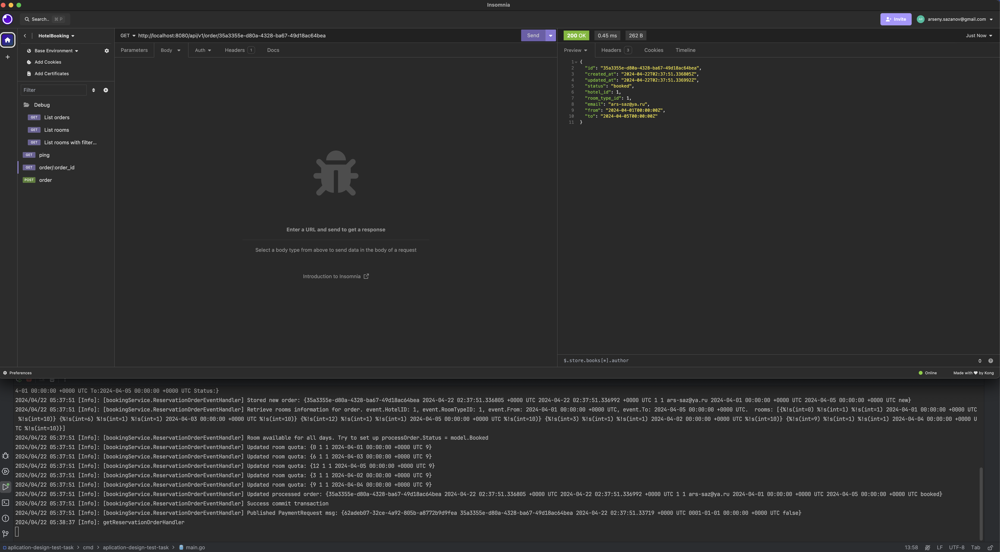

# Application design

В коде представлен прототип сервиса бронирования номеров в отелях,
в котором реализована возможность забронировать свободный номер в отеле.

Сервис будет развиваться, например:

- появится отправка письма-подтверждения о бронировании
- появятся скидки, промокоды, программы лояльности
- появится возможность бронирования нескольких номеров

## Задание

Провести рефакторинг структуры и кода приложения, исправить существующие
проблемы в логике. Персистентное хранение реализовывать не требуется,
все данные храним в памяти сервиса.

В результате выполнения задания ожидается структурированный код сервиса,
с корректно работающей логикой сценариев бронирования номеров в отелях.

Чеклист:

- код реорганизован и выделены слои
- выделены абстракций и интерфейсы
- техническе и логические ошибки исправлены

Ограничения:

- ожидаем реализацию, которая управляет состоянием в памяти приложения,
 но которую легко заменить на внешнее хранилище
- если у тебя есть опыт с Go: для решения надо использовать только
 стандартную библиотеку Go + роутер (например chi)
- если у тебя нет опыта с Go: можно реализовать решение на своем
 любимом стеке технологий

## Что будет на встрече

На встрече ожидаем что ты продемонстрируешь экран и презентуешь свое решение:
расскажешь какими проблемами обладает исходный код и как они решены в твоем варианте.
Мы будем задавать вопросы о том почему было решено разделить ответственность между
компонентами тем или иным образом, какими принципами ты при этом руководствуешься.
Спросим что будет если продакт решит добавить какую-то новую фичу — как она ляжет
на предложенную тобой структуру. Также можем поговорить и о более технических вещах:
о значениях и указателях, многопоточности, интерфейсах, каналах.

## Например

```sh
go run main.go
```

```sh
curl --location --request POST 'localhost:8080/orders' \
--header 'Content-Type: application/json' \
--data-raw '{
    "hotel_id": "reddison",
    "room_id": "lux",
    "email": "guest@mail.ru",
    "from": "2024-01-02T00:00:00Z",
    "to": "2024-01-04T00:00:00Z"
}'
```

------

### Completing a test task

The test task began with the preparation of an architectural diagram of the service.

Below are two diagrams:

The first is a general, typical diagram of a multi-node microservice application that could be applicable as the basis for the architecture of a future room booking service application.


The second diagram is a more detailed one, taking into account the constraints outlined in this document for the test task.


This diagram represents a monolithic application (one node) in the Go language, within which abstractions are clearly delineated for future separation into individual microservices.

In this case, we are talking about `Booking`, `Payment`, and `Notification` services. (Some services, such as `Payment` and `Notification`, were not implemented as they were beyond the scope of this test task.)

For simplicity in understanding and inspiration during the development of the architecture, I was guided by the [hexagonal architecture](https://en.wikipedia.org/wiki/Hexagonal_architecture_(software)) and the [Saga pattern](https://learn.microsoft.com/en-us/azure/architecture/reference-architectures/saga/saga).

The main task was to ensure the possibility of horizontal scaling in the future plus the absence of races and deterministic room booking.

The next stage after preparing architectural diagrams was the refactoring of the application structure.

Again, the hexagonal model of application construction was taken as a basis, with the delineation of components of the domain area, adapters, services, and servers.

External scripts and auxiliary packages lie outside the `internal` folder.

During the code review, you may encounter `todo` comments as well as just comments for the `to future`.

These comments have been intentionally left to demonstrate a considerate approach to development.

As proof of the application's functionality, you can find screenshots of the working application with logs, and example requests in the `docs/proof_of_work` folder.

The work was carried out using the Goland IDE from JetBrains over the weekend from `20.04.2024` to `22.04.2024`.

Should you have any questions, I am prepared to provide answers.

Thank you for your attention.

### Proof Of Work





